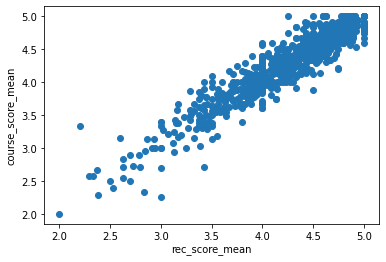
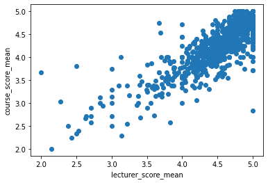
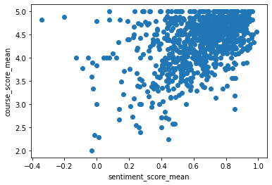
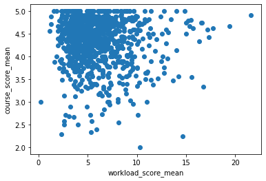
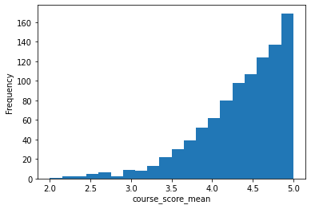
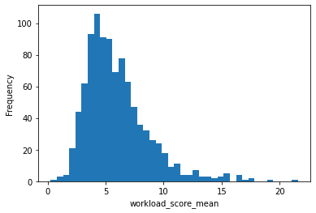
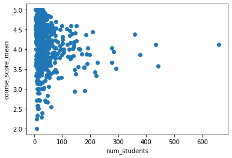

# myHarvard and QGuide scraper

This project scrapes [myHarvard](https://my.harvard.edu/) and the [QGuide](https://qreports.fas.harvard.edu/). Current results are at [release](./release). Archived results at [archive](./archive).

The project is initally built for [hugems.net](https://jeqcho.github.io/harvard-gems) on finding gems, but you can use the CSV for anything you like.

If you found it useful, you can

[](https://www.buymeacoffee.com/jeqcho)

## Results

Course ratings correlate well with recommendation scores.



Course ratings also correlate well with lecturer scores, but with more scatter.



Sentiment analysis on the course comments also agree well with its average course rating.



Most high-scoring courses have low workload.



Harvard classes tend to have high ratings. It is rare to get a low score.



Most Harvard classes have a workload demand of around 5 hours per week outside of classes, though the distribution is skewed so some classes have much higher workloads.



There is little correlation between the number of students in the class and the score of the class.



## Installation

This project uses [uv](https://docs.astral.sh/uv/) for fast dependency management. Python 3.11 is required for numpy compatibility.

First, install uv if you haven't already:

```bash
# On macOS and Linux
curl -LsSf https://astral.sh/uv/install.sh | sh

# On Windows
powershell -c "irm https://astral.sh/uv/install.ps1 | iex"
```

Then install dependencies:

```bash
uv sync
```

This will automatically create a virtual environment with Python 3.11 and install all dependencies.

## Usage

You probably don't need to follow the steps below since the results can be found at [release](./release) (or [archive](./archive) for older results). If you want to replicate the data release or if you are maintaining this repo for future data release, you can follow the steps below.


### Scraping the QGuide

The code for this section is at [src/qguide](./src/qguide).

1. First the program needs to discover all the QGuide links for that year and term. Navigate to this link `https://qreports.fas.harvard.edu/browse/index?school=FAS&calTerm=YEAR%20SEMESTER` where you replace `YEAR` with the year you want the qguide for (e.g. `2025`) and `SEMESTER` with one of `Spring` and `Fall`. It requires login.
2. Download the webpage (<kbd>ctrl</kbd>+<kbd>s</kbd> or <kbd>cmd</kbd>+<kbd>s</kbd>) as a HTML-only file. Keep the default name `QReports.html` and put it in this folder replacing the old file.
3. Make sure you are in right folder, if not run `cd src/qguide`. Then Run `uv run scraper.py` to scrape the links for the QGuides for each course. The links generated will be stored at `courses.csv`.
4. Visit the first QGuide link scrapped at `courses.csv`. Be careful in VSCode, since it will concat the other fields and result in an invalid URL, so don't cmd+click, but instead copy paste the link.
5. Open the Developer Console, go to Application and click on the Cookie tab. Get the values for `ASP.NET_SessionId` and `CookieName` and paste it to `src/qguide/secret_cookie.txt` in the following format
   ```text
   ASP.NET_SessionId=YOUR_VALUE_HERE;CookieName=YOUR_VALUE_HERE
   ```
6. Make sure you delete the current `QGuides` folder to start afresh if it exists.
7. Run `uv run downloader.py` to use your cookies to download all the QGuides with the links scrapped from the previous step. The QGuides will be stored at the folder `QGuides`. This takes about 6 minutes.
8. Run `uv run analyzer.py` to generate `course_ratings.csv`. If you run into a course with bugs, you can copy that FAS string and paste it to the `demo or debug` section of the code. My usual debugging process is to search for that file in the IDE (cmd+p and paste in the course code that begins with FAS-, the file should show up), reveal in Finder, open in Chrome and see what's up. It's fine to ignore some files with errors, if for example they only contain the response ratio and nothing else.
9. Once that's done, rename `course_ratings.csv` as `YEAR_TERM.csv` like `2025_Fall.csv` and put this in `release/qguide`.

### Scraping myHarvard

The code for this section is at [src/myharvard](./src/myharvard).

1. Specify the `year` and `term` at the bottom of `get_myharvard_url_chunks.py` and run it (`uv run get_myharvard_url_chunks.py`) to get the URL chunks of the courses that will be offered. This will generate `course_urls.txt` and takes around 3 minutes.
2. Run `uv run get_all_course_data.py` to get `all_courses.csv`.
3. Rename this as `YEAR_TERM.csv` like `2026_Spring.csv` and put this in `release/myharvard`.


### Combining QGuide and myHarvard for hugems.net

[hugems.net](hugems.net) combines the course offerings on myHarvard of a semester on a year and combines that with the feedback reports on QGuide of the previous year. Note that hugems.net does not provide any information on courses that are spaced two years apart. This section describes how the data release was made for [hugems.net](hugems.net).

The code for this section is at [src/hugems](./src/hugems).

1. Specify the years and terms for the myharvard and qguide at `combine.py` and run it (`uv run combine.py`) to get `qguide_myharvard.csv` automatically in the release folder. The CSV inner joins the myHarvard records with the qguide using `course_id`.
2. Edit the year and terms at `course_ratings_analysis.ipynb` and run the notebook. This will generate the graphs above and the rest of the data release at `release/hugems`. Follow through the notebook and play around!


# Future todo

- There is a course catalog PDF at the beta myHarvard. We can use that to generate the myHarvard URLs instead of cycling through the actual website. This will cut down the waiting time from about 10 minutes to near instant, and also save some traffic from hitting Harvard's server.
- HDS and XREG has bug where their catalog number of the pagination process has a suffix that doesn't appear in the actual URL. Right now, we catch this error when it happens and remove that suffix on the go. There might be a better way to do this.
- The `src/qguide` code is ancient (pre-Cursor) and can benefit from better design. For example, one can get a better methodology for the gems, especially given LLMs nowadays.
- There are duplicates on the myHarvard pagination. For example, for 2025 Fall, you can find similar classes (e.g. see Ochestra) on [page 29](https://beta.my.harvard.edu/?q=&school=All&sort=relevance&page=29&Term=2025+Fall&term=All) and on [page 47](https://beta.my.harvard.edu/?q=&school=All&sort=relevance&page=47&Term=2025+Fall&term=All). Right now we drop duplicate rows at `get_all_course_data.py`, but there might be a better way to do this.
- Sometimes, the unique code in `qguide` is not unique when two people with the same last name teach the course together (see GENED 1069 - Courtney Lamberth, Fall 2024). Currently, we simply drop duplicates in `src/hugems/combine.py`.
- Instead of manually copying over the release files we can programmatically do that.
- At time of writing March 31 2025, the beta myharvard search doesn't show the course level (though it allows filtering by it). Implement course level scraping somehow. (the old myharvard has it).
- The new search groups the EXPOS 20 courses under a single course as different sections suffixing the URL with `201`, `202` etc, though they have different course IDs. We currently don't have EXPOS 20 scrapped because we scrape by assuming all the URLs begin with `001`.